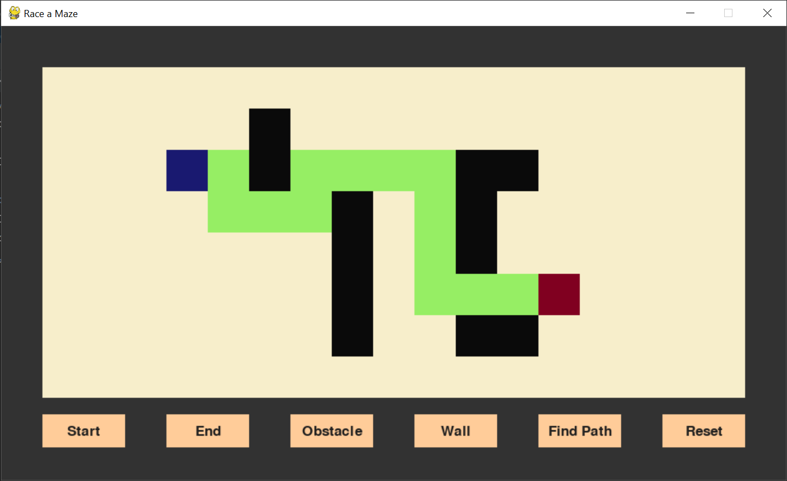
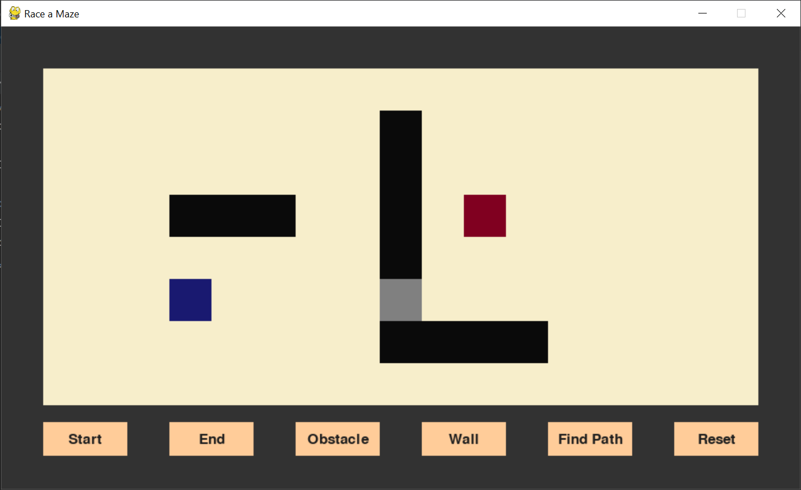
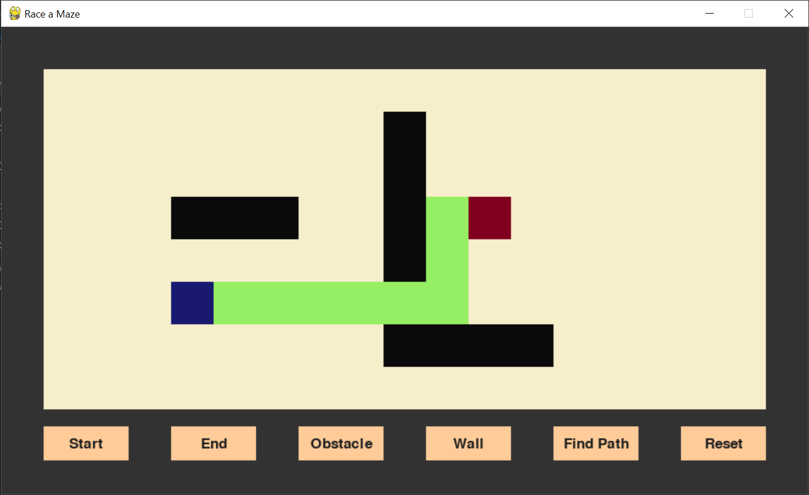

# Maze Solver

Maze Solver is a Python application that solves user generated mazes using Pygame

This game uses a modified implementation of [Dijkstra's algorithm](https://en.wikipedia.org/wiki/Dijkstra%27s_algorithm) 
to find the shortest path in a graph. The algorithm keeps track of the preceding vertices for any given shortest path 
and uses that traversal history to create the most efficient path from a starting point
to anywhere in the board

## Additional features

Walls and obstacles can be added by the user in order to limit the choices available to the 
program. The values for obstacles can be set in the [parameters.py](parameters.py) file

Here's an example of a maze containing walls (black squares):



<br />
We can also add obstacles, which by default are equivalent to traversing 6 squares.
Here's an example of a path with obstacles (grey squares):




In this example, traversing the obstacle will produce a shorter path:



## Installation
Use the package manager [pip](https://pip.pypa.io/en/stable/) to install all the necessary dependencies
```bash
pip install -r requirements.txt
```

## Usage
```bash
python maze.py
```